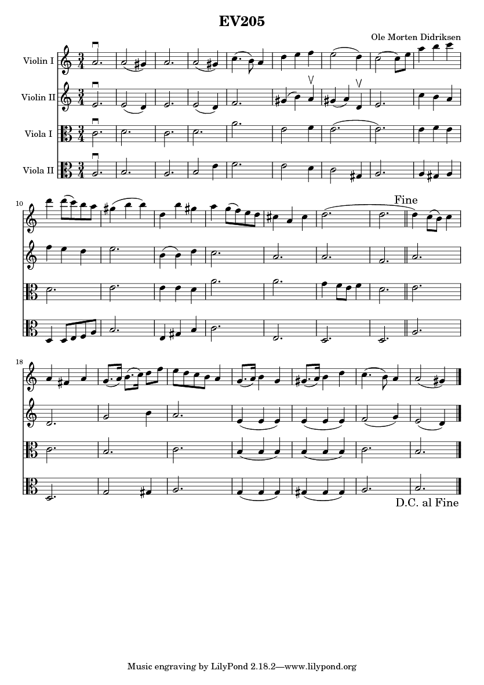

# EV205
A composition for two violins and two violas by [@oledid](https://github.com/oledid/), inspired by buying a Yamaha EV-205 in 2009.

The notes are written in [Lilypond](http://www.lilypond.org). If you have lilypond in your PATH, you can rebuild the score with `gulp build` or `gulp watch` after running `npm install`.

## License
EV-205 by Ole Morten Didriksen is licensed under a [Creative Commons Attribution-NonCommercial-ShareAlike 4.0 International License](http://creativecommons.org/licenses/by-nc-sa/4.0/).

## Compiled score

You can listen to the audio [here](https://raw.githubusercontent.com/oledid/ev205-for-two-violins-and-two-violas/master/ev205.mp4) (a video generated with [Captura](https://github.com/MathewSachin/Captura) and [MuseScore](https://github.com/musescore/MuseScore))

